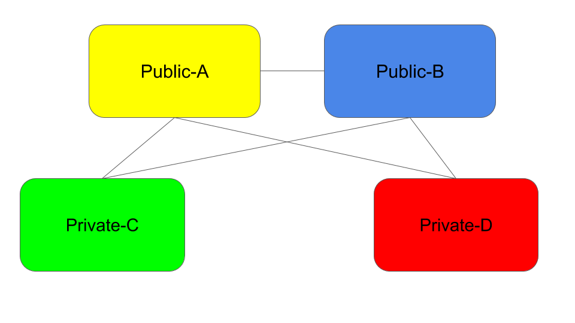

# skupper-example-kubecon2020

This repository contains the source code and notes from the demonstration that
was presented during the "Virtual Application Networks for Cloud Native
Applications" presentation at KubeCon NA 2020 on November 20, 2020.

In the demonstration, the cloud locations were AWS, Azure, Laptop, and Remote.
These were running OpenShift 4, Kube (AKS), Minikube, and OpenShift 3.11
respectively.  For the purposes of reproducing the demonstration, it doesn't
matter which flavor of Kubernetes is running in each location.

Since you may not have access to the same set of cloud platforms, we will
refer to the locations as Public-A, Public-B, Private-C, and Private-D.
Public-A and Private-C will host instances of the service and the
load-generating client will run on Private-D.



## Setting up KNative Serving

KNative Serving must be configured on the two sites where instances of the
service will run (Public-A, Private-C).  The following instructions were
obtained from the KNative Tutorial.

Apply the following instructions on Public-A and Private-C:

Install KNative Serving:

```
kubectl apply -f https://github.com/knative/serving/releases/download/v0.14.0/serving-core.yaml
```

Install Kourier:

```
kubectl apply -f https://github.com/knative/net-kourier/releases/download/v0.14.0/kourier.yaml
```

Configure KNative Serving to use Kourier:

```
kubectl patch configmap/config-network \
  -n knative-serving \
  --type merge \
  -p '{"data":{"ingress.class":"kourier.ingress.networking.knative.dev"}}'
```

Create namespace:

```
kubectl create namespace knativetutorial
```

## Get the Skupper CLI tool

You will use the Skupper command line tool to set up the network.  Download
instructions can be found on the [Getting Started](https://skupper.io/start/index.html)
page of the Skupper website.

## Setting up the Skupper network

In the context of each cloud site, run the `skupper init` command to install
skupper into the namespace.  For Public-A and Private-C, you must use the
`knativetutorial` namespace to be compatible with the provided yaml scripts.
In Public-B and Private-C, you may use any namespace you like.

On Public-A:
```
skupper -n knativetutorial init --site-name PubA
skupper -n knativetutorial connection-token puba.yaml
```

On Public-B:
```
skupper init --site-name PubB
skupper connection-token pubb.yaml
```

On Private-C we will enable console access:
```
skupper -n knativetutorial init --site-name PrivC --enable-console --console-auth unsecured
```

On Private-D:
```
skupper init --site-name PrivD
```

If necessary, copy the `puba.yaml` and `pubb.yaml` token files to where they
can be used in the context of the private cloud sites.

On Public-B:
```
skupper connect puba.yaml --cost 5
```

On Private-C:
```
skupper -n knativetutorial connect puba.yaml --cost 5
skupper -n knativetutorial connect pubb.yaml
```

On Private-D:
```
skupper connect puba.yaml --cost 5
skupper connect pubb.yaml
```

Once the network makes its connections can establishes its neighbors and
topology, the `skupper status` command will display the site's view of the
network.

To access the Skupper console, use `kubectl get services` on Private-C to find
the external IP address of the skupper-controller service.  Point your web
browser to this address followed by `:8080`.

## Launching the service instances

On both Public-A and Private-C, install the KNative service and use Skupper to expose the services across the network:
```
kubectl -n knativetutorial apply -f yaml/service-kn.yaml
kubectl -n knativetutorial apply -f yaml/skupper.yaml
```

You can verify that the cross-network exposure is working by running `kubectl
get services` on each of your sites.  The `greeting` service should be
available on each site.

On Private-D, deploy the load-generating client:
```
kubectl apply -f yaml/load-gen.yaml
```

## Adjust the generated load on the services

The load-gen client starts up with zero load.  It provides two web APIs: One
for setting the concurrency (load) and another for viewing the distribution of
service instances handling its requests.  Begin by finding the service address
for the load-gen deployment.

On Private-D:
```
kubectl get services
```

Find the IP address of the `load-gen` service and use that address in a curl command to set the concurrency:

```
curl http://${LOAD_GEN_IP}:8080/loadgen/set/1
```

The number at the end of the query string is the desired concurrency.  The
load generator will issue N concurrent requests to the `greeting` service and
issue a new request each time it receives a response in order to maintain a
constant backlog of N in-flight requests.

To view a histogram of service instances that are responding to requests, use the following command:

```
curl http://${LOAD_GEN_IP}:8080/loadgen/status
```

This will display the proportion of responses by service instance for the last 100 responses.

With the configuration described in this document, a concurrency of `1` will result in all of the responses coming from the service instance in Private-C.  With a concurrency of `10`, the service instance in Public-A will spin up to handle a portion of the request load.


